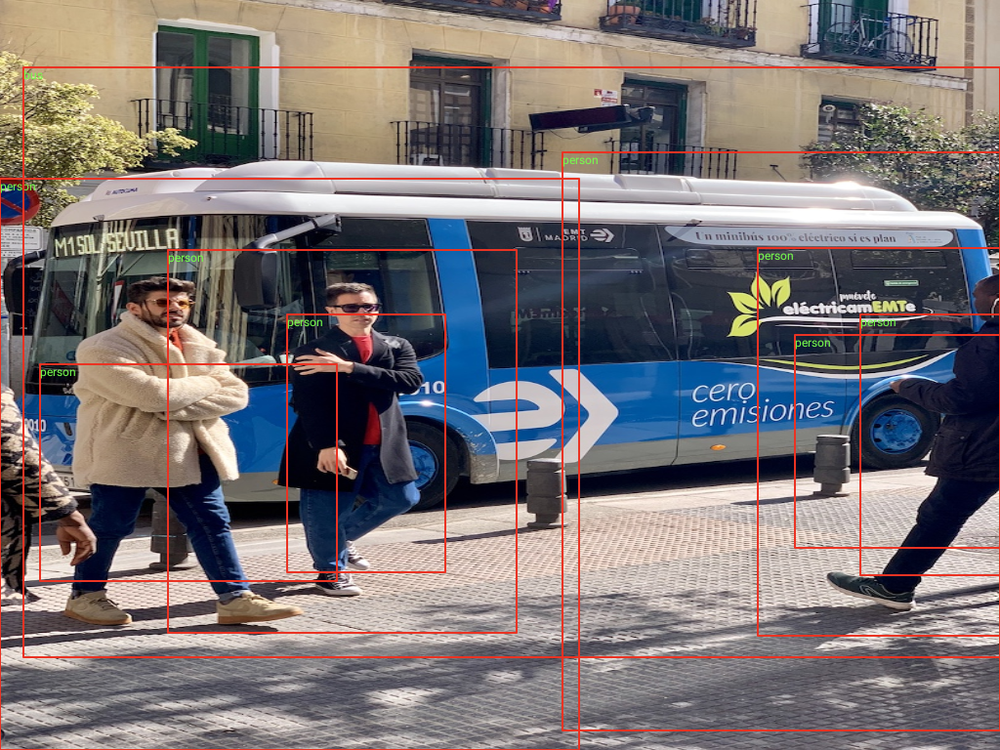

# cv_npu

用于开发测试cv_aix安卓库的apk, 在3588主板上调用rknn模型完成物体检测。

## 1. 将yolov5-7.0模型转换为rknn模型

### 1.0 创建虚拟环境yolov5-7.0
```bash
$ pip3 install virtualenv virtualenvwrapper
$ source /usr/local/bin/virtualenvwrapper.sh
$ mkvirtualenv yolov5-7.0 -p /usr/bin/python3.8
(yolov5-7.0) $ pip3 install torch==1.12.1+cpu torchvision==0.13.1+cpu torchaudio==0.12.1 --extra-index-url https://download.pytorch.org/whl/cpu
(yolov5-7.0) $ pip3 install ultralytics albumentations tensorboard==2.8.0 
(yolov5-7.0) $ pip3 install onnx onnxruntime onnxruntime-gpu
```

### 1.1 将pt转为onnx

- 参考连接 https://github.com/airockchip/yolov5/blob/master/README_rkopt.md

```bash
(yolov5-7.0) $ mkdir -p yolov5_rknn/model/
(yolov5-7.0) $ cd yolov5_rknn/model/
(yolov5-7.0) $ wget https://github.com/ultralytics/yolov5/releases/download/v7.0/yolov5s.pt
(yolov5-7.0) $ cd ~/yolov5_rknn
(yolov5-7.0) $ git clone https://github.com/airockchip/yolov5.git
(yolov5-7.0) $ cd yolov5
(yolov5-7.0) $ python export.py --rknpu --weight /home/tianzx/yolov5_rknn/model/yolov5s.pt 
```

### 1.2 将onnx转为rknn

- 安装rknn-toolkit2

```bash
(yolov5-7.0) $ cd ~/yolov5_rknn
#!< 安装依赖库
(yolov5-7.0) $ git clone https://github.com/airockchip/rknn-toolkit2.git --depth 1
(yolov5-7.0) $ cd rknn-toolkit2/rknn-toolkit2/
(yolov5-7.0) $ pip install -r packages/requirements_cp38-2.0.0b0.txt
(yolov5-7.0) $ pip install packages/rknn_toolkit2-2.0.0b0+9bab5682-cp38-cp38-linux_x86_64.whl
```

- 将onnx转为rknn

```bash
(yolov5-7.0) $ cd ~/yolov5_rknn/rknn_model_zoo/examples/yolov5/python/
(yolov5-7.0) $ vi convert.py
DATASET_PATH = '../../../datasets/COCO/coco_subset_20.txt'

(yolov5-7.0) $ python convert.py /home/tianzx/yolov5_rknn/model/yolov5s.onnx rk3588 i8 /home/tianzx/yolov5_rknn/model/yolov5s.rknn
(yolov5-7.0) $ ls -hl ~/yolov5_rknn/model
total 144M
-rw-rw-r-- 1 tianzx tianzx 81M 8月  26 16:38 yolov5s.onnx
-rw-rw-r-- 1 tianzx tianzx 41M 11月 22  2022 yolov5s.pt
-rw-rw-r-- 1 tianzx tianzx 22M 8月  26 16:43 yolov5s.rknn
```

## 2. 调用方式

```java
Bitmap m_phone = null;
String m_result = "";

final String rknn_model_name = "yolov5s.rknn";
final String rknn_label_name = "coco_80_labels_list.txt";
String img_name = "20240826.jpg";

CvAix cvAix = new CvAix();
EpboxCV dr = cvAix.doPicQrAndDetect(input, ai_model_folder, rknn_model_name, rknn_label_name, img_name);
m_phone = dr.phone;
m_result ="cv_aix库方法调用耗时(毫秒): " + time_expend + "\ndetect_res:" + dr.detect_res;
```

## 3. 调用结果

 
 
 
